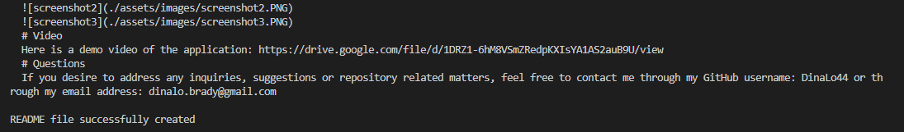

# professional-readme-generator
  
   

  http://github.com/DinaLo44/professional-readme-generator

  # Description
  This application facilitates the creation of a README file through node.js. Once the user opens the integrated terminal and type the correct commands, the application will display multiple questions to populate the content of the README file. Once the user has answered all questions, the application displays a message indicating that the README file was successfully created. It is an easy process that will save a lot of time to busy developers.
  # Table of Contents
  - [Installation](#installation)
  - [Usage](#usage)
  - [License](#license)
  - [Contributing](#contributing)
  - [Tests](#tests)
  - [Screenshots](#screenshots)
  - [Video](#video)
  - [Questions](#questions)
  # Installation
  In order to run this application the user needs to install  the “inquirer” module . However, in order to do that, first, it is required to type in the terminal the commands “npm init -y” to install the “node_modules” folder with all node packages including the package.json and package-lock.json. After that, the user will need to type “npm install inquirer”. Additionally, the user will have to include the File System module by using the require() method in the index.js file.
  # Usage
  The usage of this application consists in helping developers to accelerate the creation process of a professional README file that satisfies all industry standards so that they can invest more time in other time-consuming parts of their projects. 
  # License 
  The license used for this application is APACHE 2.0
  https://opensource.org/licenses/Apache-2.0
  # Contributing
  Additional contributors involved in this application:  NA
  # Tests
  The following commands are needed in order to test this application: node index.js
  # Screenshots
  
  
  
  # Video 
  Here is a demo video of the application: https://drive.google.com/file/d/1DRZ1-6hM8VSmZRedpKXIsYA1AS2auB9U/view
  # Questions
  If you desire to address any inquiries, suggestions or repository related matters, feel free to contact me through my GitHub username: DinaLo44 or through my email address: dinalo.brady@gmail.com
  